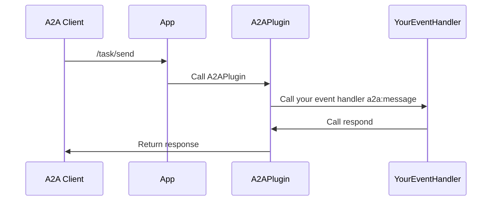

import FileCodeBlock from '@site/src/components/FileCodeBlock';

# A2A Server

## What is an A2A Server?

An A2A server is an agent that exposes its capabilities to other agents using the A2A protocol. With this package, you can make your Teams app accessible to A2A clients.

## Adding the `A2APlugin`

::: zone pivot="csharp"
<!-- Missing section content -->
::: zone-end

::: zone pivot="python"
To enable A2A server functionality, add the `A2APlugin` to your Teams app and provide an `agent_card`:
::: zone-end

::: zone pivot="javascript"
To enable A2A server functionality, add the `A2APlugin` to your Teams app and provide an `agentCard`:
::: zone-end


::: zone pivot="csharp"
<!-- Missing section content -->
::: zone-end

::: zone pivot="python"
```python
from os import getenv
from a2a.types import AgentCard, AgentCapabilities, AgentSkill
from microsoft_teams.a2a import A2APlugin, A2APluginOptions
from microsoft_teams.apps import App, PluginBase

PORT = getenv("PORT", "4000")

agent_card = AgentCard(
    name="weather_agent",
    description="An agent that can tell you the weather",
    url=f"http://localhost:{PORT}/a2a/",
    version="0.0.1",
    protocol_version="0.3.0",
    capabilities=AgentCapabilities(),
    default_input_modes=[],
    default_output_modes=[],
    skills=[
        AgentSkill(
            # Expose various skills that this agent can perform
            id="get_weather",
            name="Get Weather",
            description="Get the weather for a given location",
            tags=["weather", "get", "location"],
            examples=[
                # Give concrete examples on how to contact the agent
                "Get the weather for London",
                "What is the weather",
                "What's the weather in Tokyo?",
                "How is the current temperature in San Francisco?",
            ],
        ),
    ],
)

plugins: List[PluginBase] = [A2APlugin(A2APluginOptions(agent_card=agent_card))]
app = App(logger=logger, plugins=plugins)
```
::: zone-end

::: zone pivot="javascript"
```typescript
import { AgentCard } from '@a2a-js/sdk';
import { A2APlugin } from '@microsoft/teams.a2a';
import { App } from '@microsoft/teams.apps';

const agentCard: AgentCard = {
  name: 'Weather Agent',
  description: 'An agent that can tell you the weather',
  url: `http://localhost:${PORT}/a2a`,
  version: '0.0.1',
  protocolVersion: '0.3.0',
  capabilities: {},
  defaultInputModes: [],
  defaultOutputModes: [],
  skills: [
    {
      id: 'get_weather',
      name: 'Get Weather',
      description: 'Get the weather for a given location',
      tags: ['weather', 'get', 'location'],
      examples: [
        'Get the weather for London',
        'What is the weather',
        "What's the weather in Tokyo?",
        'How is the current temperature in San Francisco?',
      ],
    },
  ],
};

const app = new App({
  plugins: [
    new A2APlugin({
      agentCard,
    }),
  ],
});
```
::: zone-end


## Agent Card Exposure

The plugin automatically exposes your agent card at the path `/a2a/.well-known/agent-card.json`.

## Handling A2A Requests

Handle incoming A2A requests by adding an event handler for the `a2a:message` event. You may use `accumulateArtifacts` to iteratively accumulate artifacts for the task, or simply `respond` with the final result.


::: zone pivot="csharp"
<!-- Missing section content -->
::: zone-end

::: zone pivot="python"
```python
from microsoft_teams.a2a import A2AMessageEvent, A2AMessageEventKey
from a2a.types import TextPart

@app.event(A2AMessageEventKey)
async def handle_a2a_message(message: A2AMessageEvent) -> None:
    request_context = message.get("request_context")
    respond = message.get("respond")

    logger.info(f"Received message: {request_context.message}")

    if request_context.message:
        text_input = None
        for part in request_context.message.parts:
            if getattr(part.root, "kind", None) == "text":
                text_part = cast(TextPart, part.root)
                text_input = text_part.text
                break
        if not text_input:
            await respond("My agent currently only supports text input")
            return

        result = await my_event_handler(text_input)
        await respond(result)
```
::: zone-end

::: zone pivot="javascript"
```typescript
app.event('a2a:message', async ({ respond, requestContext }) => {
  logger.info(`Received message: ${requestContext.userMessage}`);
  const textInput = requestContext.userMessage.parts
    .filter((p): p is TextPart => p.kind === 'text')
    .at(0)?.text;
  if (!textInput) {
    await respond('My agent currently only supports text input');
    return;
  }
  const result = await myEventHandler(textInput);
  await respond(result);
});
```
::: zone-end


:::note

- You must have only a single handler that calls `respond`.
- You **must** call `respond` as the last step in your handler. This resolves the open request to the caller.

:::

## Sequence Diagram


